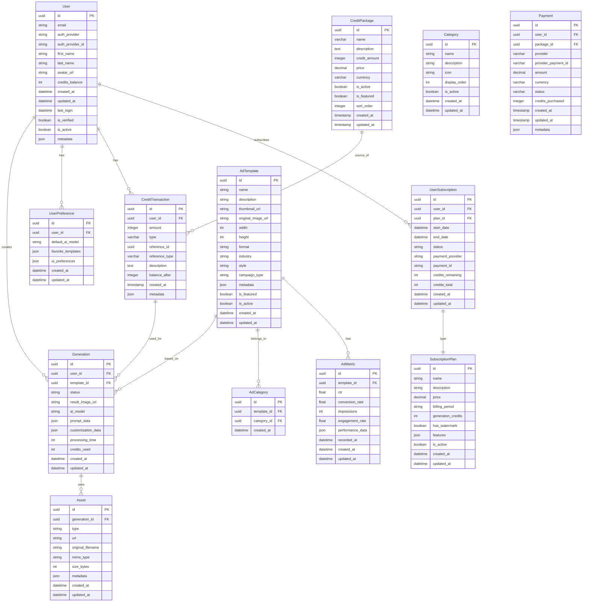

# CraftAds - Database Schema Design

## Overview

This document outlines the database schema design for the CraftAds application, detailing the tables, relationships, and key considerations for data storage and retrieval.

## Database Technology

The primary database for CraftAds is PostgreSQL, chosen for its:
- Robust handling of relational data
- Advanced querying capabilities
- JSON/JSONB support for flexible data structures
- Strong integrity constraints
- Open-source reliability

Redis will be used as a complementary technology for:
- Caching frequently accessed data
- Session management
- Job queue storage
- Rate limiting

## Schema Diagram

## Table Definitions

### 1. User Tables

#### 1.1 User

Stores core user information.

| Column | Type | Description |
|--------|------|-------------|
| id | UUID | Primary key |
| email | VARCHAR(255) | User's email address, unique |
| auth_provider | VARCHAR(50) | Authentication provider (e.g., 'google', 'email') |
| auth_provider_id | VARCHAR(255) | ID from the authentication provider |
| first_name | VARCHAR(100) | User's first name |
| last_name | VARCHAR(100) | User's last name |
| avatar_url | VARCHAR(255) | URL to user's profile image |
| credits_balance | INTEGER | Current credit balance for image generation |
| created_at | TIMESTAMP | Record creation timestamp |
| updated_at | TIMESTAMP | Record update timestamp |
| last_login | TIMESTAMP | Time of last login |
| is_verified | BOOLEAN | Email verification status |
| is_active | BOOLEAN | Account active status |
| metadata | JSONB | Flexible metadata storage |

Indexes:
- Primary Key: id
- Unique: email
- Unique: (auth_provider, auth_provider_id)
- Index: is_active, created_at

#### 1.2 UserPreference

Stores user-specific application preferences.

| Column | Type | Description |
|--------|------|-------------|
| id | UUID | Primary key |
| user_id | UUID | Foreign key to User |
| default_ai_model | VARCHAR(50) | User's preferred AI model |
| favorite_templates | JSONB | Saved/favorite ad templates |
| ui_preferences | JSONB | UI customization settings |
| created_at | TIMESTAMP | Record creation timestamp |
| updated_at | TIMESTAMP | Record update timestamp |

Indexes:
- Primary Key: id
- Foreign Key: user_id
- Index: user_id

#### 1.3 UserSubscription

Tracks user subscription details.

| Column | Type | Description |
|--------|------|-------------|
| id | UUID | Primary key |
| user_id | UUID | Foreign key to User |
| plan_id | UUID | Foreign key to SubscriptionPlan |
| start_date | TIMESTAMP | Subscription start date |
| end_date | TIMESTAMP | Subscription end date |
| status | VARCHAR(20) | active, canceled, expired |
| payment_provider | VARCHAR(50) | stripe, paypal, etc. |
| payment_id | VARCHAR(100) | Provider-specific payment ID |
| credits_remaining | INTEGER | Remaining generation credits |
| credits_total | INTEGER | Total generation credits |
| created_at | TIMESTAMP | Record creation timestamp |
| updated_at | TIMESTAMP | Record update timestamp |

Indexes:
- Primary Key: id
- Foreign Keys: user_id, plan_id
- Index: status, end_date

#### 1.4 SubscriptionPlan

Defines available subscription plans.

| Column | Type | Description |
|--------|------|-------------|
| id | UUID | Primary key |
| name | VARCHAR(100) | Plan name |
| description | TEXT | Plan description |
| price | DECIMAL(10,2) | Plan price |
| billing_period | VARCHAR(20) | monthly, yearly, etc. |
| generation_credits | INTEGER | Credits per billing cycle |
| has_watermark | BOOLEAN | Whether results have watermark |
| features | JSONB | Plan-specific features |
| is_active | BOOLEAN | Plan availability status |
| created_at | TIMESTAMP | Record creation timestamp |
| updated_at | TIMESTAMP | Record update timestamp |

Indexes:
- Primary Key: id
- Index: is_active, billing_period

### 2. Ad Template Tables

#### 2.1 AdTemplate

Stores information about available ad templates.

| Column | Type | Description |
|--------|------|-------------|
| id | UUID | Primary key |
| name | VARCHAR(100) | Template name |
| description | TEXT | Template description |
| thumbnail_url | VARCHAR(255) | URL to thumbnail image |
| original_image_url | VARCHAR(255) | URL to full-size image |
| width | INTEGER | Image width in pixels |
| height | INTEGER | Image height in pixels |
| format | VARCHAR(20) | jpg, png, etc. |
| industry | VARCHAR(50) | Relevant industry |
| style | VARCHAR(50) | Visual style |
| campaign_type | VARCHAR(50) | Type of ad campaign |
| metadata | JSONB | Additional template data |
| is_featured | BOOLEAN | Featured status |
| is_active | BOOLEAN | Active status |
| created_at | TIMESTAMP | Record creation timestamp |
| updated_at | TIMESTAMP | Record update timestamp |

Indexes:
- Primary Key: id
- Index: industry, style, campaign_type, is_featured, is_active

#### 2.2 Category

Defines categories for organizing ad templates.

| Column | Type | Description |
|--------|------|-------------|
| id | UUID | Primary key |
| name | VARCHAR(100) | Category name |
| description | TEXT | Category description |
| icon | VARCHAR(100) | Icon identifier |
| display_order | INTEGER | Sorting order |
| is_active | BOOLEAN | Active status |
| created_at | TIMESTAMP | Record creation timestamp |
| updated_at | TIMESTAMP | Record update timestamp |

Indexes:
- Primary Key: id
- Unique: name
- Index: is_active, display_order

#### 2.3 AdCategory

Junction table for many-to-many relationship between AdTemplate and Category.

| Column | Type | Description |
|--------|------|-------------|
| id | UUID | Primary key |
| template_id | UUID | Foreign key to AdTemplate |
| category_id | UUID | Foreign key to Category |
| created_at | TIMESTAMP | Record creation timestamp |

Indexes:
- Primary Key: id
- Foreign Keys: template_id, category_id
- Unique Composite: (template_id, category_id)

#### 2.4 AdMetric

Stores performance metrics for ad templates.

| Column | Type | Description |
|--------|------|-------------|
| id | UUID | Primary key |
| template_id | UUID | Foreign key to AdTemplate |
| ctr | FLOAT | Click-through rate |
| conversion_rate | FLOAT | Conversion rate |
| impressions | INTEGER | Number of impressions |
| engagement_rate | FLOAT | User engagement rate |
| performance_data | JSONB | Additional metrics |
| recorded_at | TIMESTAMP | When metrics were recorded |
| created_at | TIMESTAMP | Record creation timestamp |
| updated_at | TIMESTAMP | Record update timestamp |

Indexes:
- Primary Key: id
- Foreign Key: template_id
- Index: recorded_at

### 3. Generation Tables

#### 3.1 Generation

Records of ad generations created by users.

| Column | Type | Description |
|--------|------|-------------|
| id | UUID | Primary key |
| user_id | UUID | Foreign key to User |
| template_id | UUID | Foreign key to AdTemplate |
| status | VARCHAR(20) | pending, completed, failed |
| result_image_url | VARCHAR(255) | URL to generated image |
| ai_model | VARCHAR(50) | AI model used |
| prompt_data | JSONB | Customization prompt data |
| customization_data | JSONB | User customization settings |
| processing_time | INTEGER | Processing time in ms |
| credits_used | INTEGER | Credits used for this generation |
| created_at | TIMESTAMP | Record creation timestamp |
| updated_at | TIMESTAMP | Record update timestamp |

Indexes:
- Primary Key: id
- Foreign Keys: user_id, template_id
- Index: status, created_at, ai_model

#### 3.2 Asset

Stores files associated with generations (uploads, results).

| Column | Type | Description |
|--------|------|-------------|
| id | UUID | Primary key |
| generation_id | UUID | Foreign key to Generation |
| type | VARCHAR(50) | upload, result, etc. |
| url | VARCHAR(255) | File access URL |
| original_filename | VARCHAR(255) | Original file name |
| mime_type | VARCHAR(100) | File MIME type |
| size_bytes | INTEGER | File size in bytes |
| metadata | JSONB | Additional file metadata |
| created_at | TIMESTAMP | Record creation timestamp |
| updated_at | TIMESTAMP | Record update timestamp |

Indexes:
- Primary Key: id
- Foreign Key: generation_id
- Index: type, created_at

### 5. Credit System Tables

#### 5.1 CreditTransaction

Tracks all credit transactions for users.

| Column | Type | Description |
|--------|------|-------------|
| id | UUID | Primary key |
| user_id | UUID | Foreign key to User |
| amount | INTEGER | Amount of credits (positive for additions, negative for deductions) |
| type | VARCHAR(50) | Type of transaction (purchase, usage, refund, promotion, etc.) |
| reference_id | UUID | Reference to the related entity (e.g., generation_id, payment_id) |
| reference_type | VARCHAR(50) | Type of the reference (generation, payment, etc.) |
| description | TEXT | Human-readable description of the transaction |
| balance_after | INTEGER | User's credit balance after this transaction |
| created_at | TIMESTAMP | Transaction timestamp |
| metadata | JSONB | Additional transaction metadata |

Indexes:
- Primary Key: id
- Foreign Key: user_id
- Index: created_at, type

#### 5.2 CreditPackage

Defines available credit packages for purchase.

| Column | Type | Description |
|--------|------|-------------|
| id | UUID | Primary key |
| name | VARCHAR(100) | Package name |
| description | TEXT | Package description |
| credit_amount | INTEGER | Number of credits in the package |
| price | DECIMAL(10,2) | Price in the default currency |
| currency | VARCHAR(3) | Currency code (e.g., USD) |
| is_active | BOOLEAN | Whether the package is available for purchase |
| is_featured | BOOLEAN | Whether the package should be highlighted |
| sort_order | INTEGER | Display order for listing packages |
| created_at | TIMESTAMP | Record creation timestamp |
| updated_at | TIMESTAMP | Record update timestamp |

Indexes:
- Primary Key: id
- Index: is_active, sort_order

#### 5.3 Payment

Stores payment information for credit purchases.

| Column | Type | Description |
|--------|------|-------------|
| id | UUID | Primary key |
| user_id | UUID | Foreign key to User |
| package_id | UUID | Foreign key to CreditPackage (if applicable) |
| provider | VARCHAR(50) | Payment provider (e.g., stripe) |
| provider_payment_id | VARCHAR(255) | Payment ID from the provider |
| amount | DECIMAL(10,2) | Payment amount |
| currency | VARCHAR(3) | Currency code |
| status | VARCHAR(50) | Payment status (completed, pending, failed, refunded) |
| credits_purchased | INTEGER | Number of credits purchased |
| created_at | TIMESTAMP | Payment timestamp |
| updated_at | TIMESTAMP | Last status update timestamp |
| metadata | JSONB | Additional payment metadata |

Indexes:
- Primary Key: id
- Foreign Key: user_id, package_id
- Unique: provider_payment_id
- Index: status, created_at

## Database Migrations

Migrations will be managed using Prisma Migrate, which allows:
- Version-controlled schema changes
- Rollback capabilities
- Environment-specific migrations
- Safe production deployments

## Data Integrity Considerations

1. **Foreign Key Constraints**: All relationships are enforced at the database level with appropriate ON DELETE and ON UPDATE behaviors.

2. **Cascading Deletes**: 
   - When a user is deleted, all related records (preferences, subscriptions, generations) are deleted
   - When a template is deleted, related records are preserved for historical data

3. **Soft Deletes**: For important data, soft deletes are implemented using is_active flags rather than actual deletion.

4. **Audit Trails**: created_at and updated_at timestamps on all tables for basic audit capabilities.

## Performance Considerations

1. **Indexing Strategy**:
   - Indexes on all foreign keys
   - Indexes on frequently queried fields
   - Composite indexes for common query patterns
   - Partial indexes for filtered queries

2. **Denormalization**:
   - Calculated metrics may be denormalized for performance
   - Cache tables for frequently accessed aggregations

3. **Partitioning**:
   - Generation table will be partitioned by created_at date for improved query performance on large datasets
   - Possibility to partition by user_id for high-volume enterprise users

## Data Retention Policy

1. **User Data**: Retained as long as account is active, deleted 30 days after account closure
2. **Generation History**: Retained for 1 year for free users, unlimited for paid users
3. **Asset Files**: 
   - Uploaded assets: 30 days for free users, 1 year for paid users
   - Generated results: 30 days for free users, unlimited for paid users

## Security Considerations

1. **Encryption**:
   - Personal data encrypted at rest
   - Sensitive fields (payment_id) encrypted using application-level encryption

2. **Access Controls**:
   - Database users with least-privilege permissions
   - Row-level security policies for multi-tenant data isolation

3. **Compliance**:
   - GDPR-compliant data structures with ability to export and delete user data
   - Audit logging for sensitive operations

## Schema Evolution

The schema is designed to be extensible with:
- JSONB fields for flexible, schema-less data where appropriate
- Versioned API endpoints to handle schema changes
- Careful migration planning for production updates 